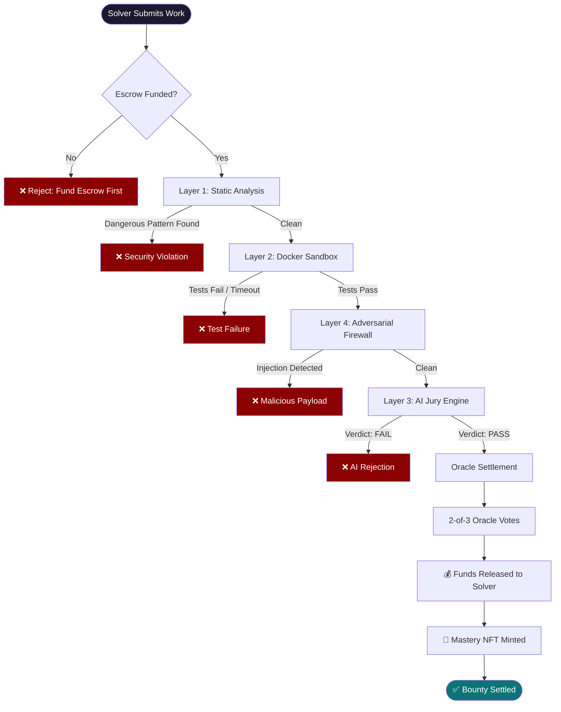
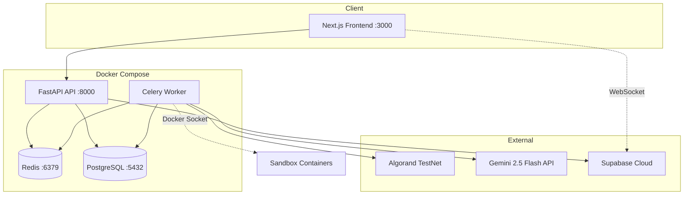
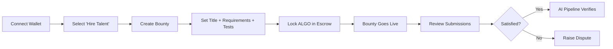
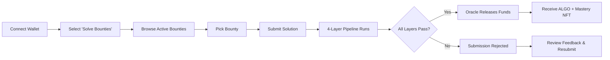
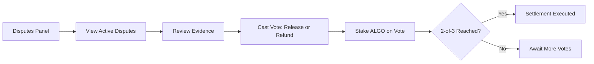

<div align="center">
  
  <h1>VORTEX Protocol</h1>
  <p><strong>Sovereign Escrow & Fault-Tolerant Resolution Engine for Web3</strong></p>
  <p><em>Deterministic, trustless bounty settlement on Algorand — powered by multi-modal AI verification and 2-of-3 Oracle consensus.</em></p>

  []()
  []()
  []()
  []()
  []()
  []()
  []()
</div>

---

## ⚔️ The Problem

Centralized freelancing platforms are broken:

| Issue | Impact |
|---|---|
| **Subjective Disputes** | Human review boards → slow, biased, unpredictable |
| **Predatory Fees** | Up to 20% platform commission |
| **No Code Verification** | Buyers "hope" the work is correct; no automated proof |
| **Payment Fraud** | Solvers "hope" they get paid; funds can be withheld arbitrarily |
| **Plagiarism & AI Abuse** | Hidden prompt injections, copy-paste spaghetti code goes undetected |

---

## 🌪️ The VORTEX Solution

VORTEX replaces subjective human judgement with **Code-is-Law Enforcement**:

1. **Buyer** posts bounty → funds locked in Algorand smart contract escrow
2. **Solver** submits work → runs through a **4-layer AI verification pipeline**
3. **Oracle Network** (2-of-3 consensus) → releases or refunds funds on-chain
4. **Mastery NFT** minted as permanent, on-chain proof of achievement

> **Key differentiator**: Deterministic, trustless settlement at 1000x faster velocity than Upwork or Fiverr — no human arbitration needed for standard cases.

---

## 🔬 The 4-Layer AI Verification Pipeline

This is the **core innovation**. Every submission passes through:



### Layer 1 — Static Analysis
AST parsing of submitted code. Blocks dangerous imports (`eval`, `exec`, `subprocess`, `os.system`, `socket`, `pickle`, `__import__`) before execution ever begins.

### Layer 2 — Docker Sandbox Execution
Runs code against buyer-defined pytest tests in a hardened container:
- `network_disabled` — no internet | `mem_limit: 128MB` | `pids_limit: 50`
- `read_only` filesystem | `user: nobody` | `cap_drop: ALL`
- `no-new-privileges` | `cpu_quota: 50%` | `45s hard timeout`

### Layer 3 — AI Jury Engine (Gemini 2.5 Flash)
Multi-modal evaluation using a consolidated Supreme Arbiter prompt (Prosecutor + Defender + Judge):
- **Code** → advisory audit (logic, quality, requirements compliance)
- **Apps** → Headless Playwright screenshots fed to Gemini Vision
- **Documents/PDFs** → binary ingestion into Gemini
- **Images** → direct Vision evaluation against brand guidelines

Output: Verdict (pass/fail), Score (0–100), Feedback, Prosecutor/Defender notes.

### Layer 4 — Adversarial Firewall
Pre-flight scan for prompt injection and jailbreak attempts. Detects role manipulation, "ignore previous instructions" attacks, and hidden payloads before they reach the AI Jury.

---

## ⛓️ Smart Contract & Oracle Consensus

**Algorand Escrow** (Puya/algopy ARC-4) — App ID `1001`

| Method | Access | Consensus | Action |
|---|---|---|---|
| `create_bounty()` | Buyer | N/A | Initialize escrow, lock funds via group tx |
| `vote_release()` | Oracle only | **2-of-3** | Release funds to developer |
| `vote_refund()` | Oracle only | **2-of-3** | Refund funds to buyer |
| `trigger_freeze()` | Oracle only | **1-of-3** | Emergency freeze (asymmetric safety) |
| `get_state()` | Anyone | N/A | Read-only state query |

**Asymmetric Design**: Easy to freeze (1-of-3, conservative safety) — hard to release/refund (2-of-3, prevents theft).

### Oracle Flow
1. Three independent oracle accounts loaded from Supabase Vault or `.env`
2. After AI pipeline passes → Oracle 1 votes `vote_release`
3. Oracle 2 votes `vote_release` → 2-of-3 threshold reached → contract executes
4. Inner transaction sends escrowed ALGO to developer
5. Any single oracle can `trigger_freeze` for emergencies

---

## 🏅 Mastery NFT System

After successful settlement:
1. Solver's artifact uploaded to cloud storage (gets a Content ID)
2. **Mastery NFT** (ASA) minted on Algorand — `unit_name: VRTX-M`, total supply: 1
3. NFT linked to bounty via `asset_name: VORTEX Mastery: {bounty_title}`
4. Displayed on solver's **Sovereign Profile** as permanent proof of capability

---

## 📁 Project Structure

```
vortex_reva/
├── backend/                  # FastAPI + Celery workers
│   ├── main.py               # API entrypoint (lifespan, middleware, routers)
│   ├── worker.py             # Celery worker — AI pipeline orchestration
│   ├── models.py             # SQLAlchemy ORM models
│   ├── database.py           # DB engine, session management
│   ├── algorand_client.py    # Algorand SDK integration
│   ├── oracle.py             # 2-of-3 Oracle consensus engine
│   ├── sandbox.py            # Docker sandbox for solver code execution
│   ├── security.py           # Prompt injection & adversarial firewall
│   ├── test_generator.py     # AI-powered test generation (Gemini)
│   ├── celery_app.py         # Celery + Redis configuration
│   ├── auth.py               # JWT & wallet signature auth
│   ├── supabase_client.py    # Supabase Realtime client
│   ├── ipfs.py               # IPFS/cloud storage for NFT artifacts
│   ├── routers/
│   │   ├── identity.py       # Auth & user profiles
│   │   ├── marketplace.py    # Bounty CRUD & submissions
│   │   ├── pipeline.py       # AI verification pipeline
│   │   ├── governance.py     # Dispute resolution & voting
│   │   ├── telemetry.py      # Realtime SSE telemetry
│   │   ├── comments.py       # Bounty discussion threads
│   │   └── health.py         # Health checks
│   ├── migrations/           # Alembic database migrations
│   ├── Dockerfile
│   └── requirements.txt
├── frontend/                  # Next.js 16 (React 19, Turbopack)
│   ├── app/                   # App Router pages
│   │   ├── bounties/          # Bounty listing & creation
│   │   ├── dashboard/         # User dashboard
│   │   ├── disputes/          # Dispute resolution UI
│   │   ├── governance/        # DAO governance panel
│   │   ├── profiles/          # Sovereign developer profiles
│   │   ├── protocol/          # Protocol analytics
│   │   ├── transactions/      # On-chain transaction feed
│   │   └── admin/             # Admin panel
│   ├── components/            # Reusable UI components
│   └── lib/                   # Client utilities & stores (Zustand)
├── contracts/                 # Algorand smart contracts
│   ├── escrow.py              # Puya/algopy ARC-4 escrow contract
│   └── deploy.py              # Contract deployment script
├── docker-compose.yml         # Full-stack containerized deployment
├── .env.example               # Environment variable template
└── SUBMISSION_DETAILS.md      # Hackathon submission reference
```

---

## 🚀 Getting Started

### Prerequisites
- Python 3.11+
- Node.js 18+
- Docker & Docker Compose *(for sandbox execution & production deployment)*
- Supabase Account *(for Realtime WebSockets)*
- Google Gemini API Key
- Algorand TestNet account *(or use Demo Mode)*

### 1. Clone & Configure

```bash
git clone https://github.com/sharonjoseph12/vortex_reva.git
cd vortex_reva

# Backend environment
cp backend/.env.example backend/.env
# Edit backend/.env with your keys (Gemini, Algorand, Supabase, etc.)
```

### 2. Local Development (Recommended)

**Backend** — uses SQLite by default, no Docker required:
```bash
cd backend
python -m venv venv
venv\Scripts\activate          # Windows
# source venv/bin/activate     # macOS/Linux
pip install -r requirements.txt

# Run API server
uvicorn main:app --reload --port 8000

# In a separate terminal — run Celery worker
celery -A celery_app worker --loglevel=info --pool=solo
```

**Frontend**:
```bash
cd frontend
npm install
cp .env.local.example .env.local
# Edit .env.local with Supabase URL and anon key
npm run dev
```

Access the application at **http://localhost:3000** with API docs at **http://localhost:8000/docs**.

### 3. Demo Mode

Set `VORTEX_DEMO_MODE=true` in your backend `.env` to run with simulated blockchain operations. The full AI verification pipeline still executes — only on-chain calls are mocked with `DEMO-ORACLE-XXXX` transaction IDs. Ideal for development and demos without real ALGO.

### 4. Containerized Production

```bash
docker-compose up -d
```

> **Note**: VORTEX uses Docker socket passthrough (`/var/run/docker.sock`) to allow Celery workers to spawn secure solver sandboxes.

### 5. Smart Contract Deployment (TestNet)

```bash
cd contracts
python deploy.py
# Deploys the escrow contract to Algorand and generates Oracle credentials.
```

---

## 🛠️ Full Stack Architecture



| Layer | Technology |
|---|---|
| **Blockchain** | Algorand (Puya/algopy ARC-4 smart contracts) |
| **Smart Contract** | App ID 1001, escrow with 2-of-3 Oracle consensus |
| **Backend API** | Python 3.11+, FastAPI |
| **Task Queue** | Celery + Redis |
| **Database** | SQLite (dev) / PostgreSQL 15 (prod) — SQLAlchemy ORM, Alembic |
| **AI Engine** | Google Gemini 2.5 Flash (multi-agent Supreme Arbiter) |
| **Frontend** | Next.js 16 (Turbopack), React 19, Zustand, CSS Modules |
| **Realtime** | Supabase Realtime (WebSockets) + SSE Telemetry |
| **Wallets** | Pera Wallet, Defly Wallet |
| **Sandbox** | Docker-in-Docker isolated execution (python:3.9-alpine) |
| **Auth** | Algorand wallet signatures + JWT |
| **Monitoring** | Sentry (opt-in), Structlog JSON logging |
| **Rate Limiting** | SlowAPI |

---

## 🌐 API Routers

| Router | Prefix | Key Endpoints |
|---|---|---|
| **identity** | `/auth` | `/nonce`, `/verify` (wallet auth), `/profile` CRUD |
| **marketplace** | `/bounties` | CRUD bounties, `/submit` work, list submissions |
| **pipeline** | `/pipeline` | `/evaluate-scope`, `/refine`, `/generate-tests`, `/validate-tests` |
| **governance** | `/disputes` | Create disputes, cast votes, arbiter dashboard |
| **telemetry** | `/events` | SSE live events, protocol pulse |
| **comments** | `/comments` | Bounty discussion threads |
| **health** | `/health` | System status (Algorand, Docker, Oracle nodes) |

---

## 🖥️ Frontend Pages

| Page | Route | Purpose |
|---|---|---|
| **Landing** | `/` | Hero, category cards, wallet connect (Pera/Defly/Demo) |
| **Dashboard** | `/dashboard` | User overview, stats, recent activity |
| **Bounties** | `/bounties` | Browse & filter active bounties |
| **Create Bounty** | `/bounties/create` | Multi-step bounty creation with AI scope evaluation |
| **Bounty Detail** | `/bounties/[id]` | View bounty, submit work, live Verification Terminal |
| **Disputes** | `/disputes` | Active disputes & voting interface |
| **Governance** | `/governance` | DAO governance panel, arbiter dashboard |
| **Profiles** | `/profiles/[wallet]` | Sovereign developer profiles, skills, reviews, Mastery Audits |
| **Protocol** | `/protocol` | Protocol-wide analytics |
| **Transactions** | `/transactions` | On-chain transaction feed |
| **Admin** | `/admin` | Admin panel |

---

## 🔐 Environment Variables

See [`.env.example`](.env.example) for the full template.

| Variable | Purpose |
|---|---|
| `GEMINI_API_KEY` | Google Gemini API key for AI Jury engine |
| `ALGORAND_ALGOD_URL` | Algorand node endpoint |
| `ORACLE_[1-3]_MNEMONIC` | 2-of-3 Oracle node mnemonics |
| `DATABASE_URL` | SQLite (dev) or PostgreSQL (prod) connection string |
| `SUPABASE_URL` | Supabase project URL |
| `SUPABASE_SERVICE_ROLE_KEY` | Supabase service role key |
| `SECRET_KEY` | JWT signing key |
| `VORTEX_DEMO_MODE` | `true` for simulated on-chain ops, `false` for real escrow |
| `APP_ID` | Smart contract app ID (default: `1001`) |
| `SENTRY_DSN` | *(Optional)* Sentry error tracking |

---

## 👥 User Flows

### Buyer (Hiring)


### Solver (Freelancer)


### Arbiter (Governance)


---

<div align="center">
  <p><strong>Engineered for unwavering trust and absolute execution.</strong></p>
  <p><sub>Built with Algorand · Gemini 2.5 Flash · Next.js 16 · FastAPI</sub></p>
</div>
