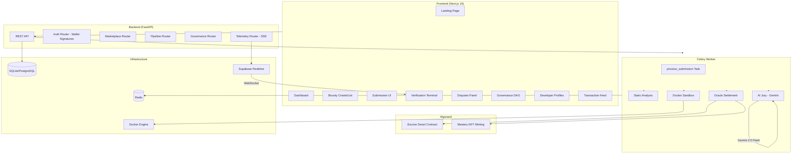
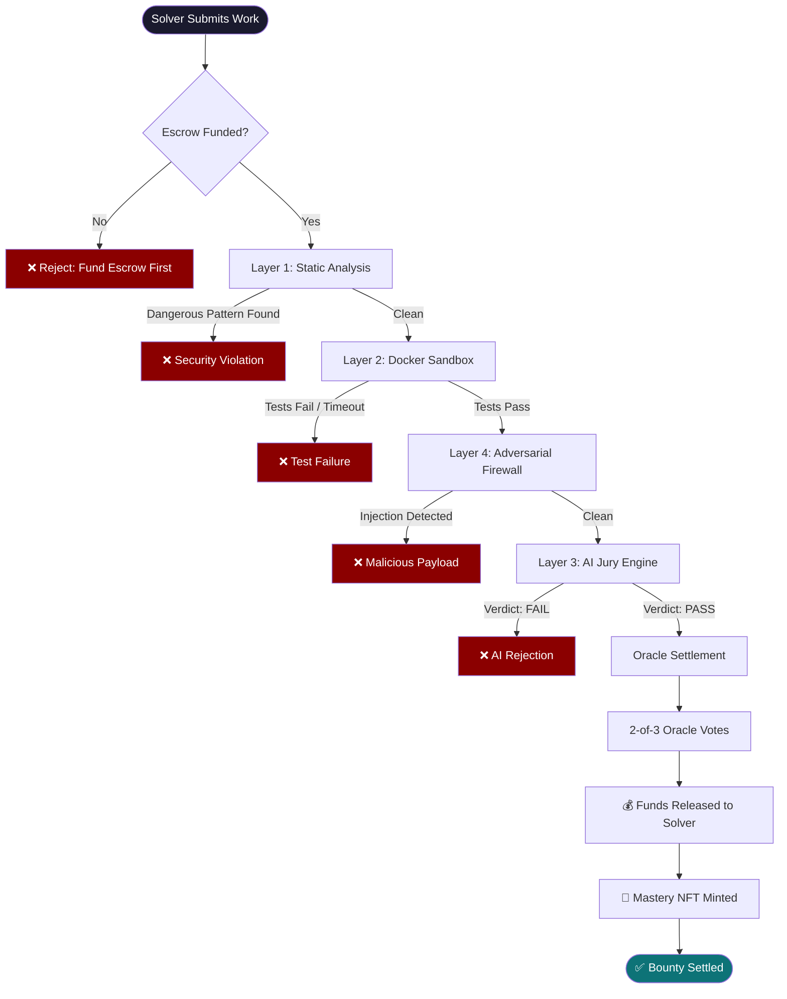
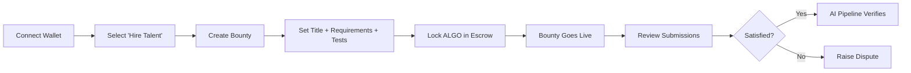
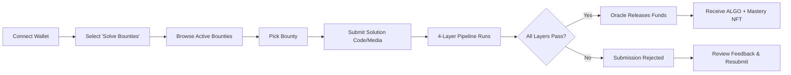
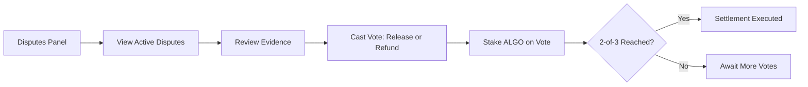
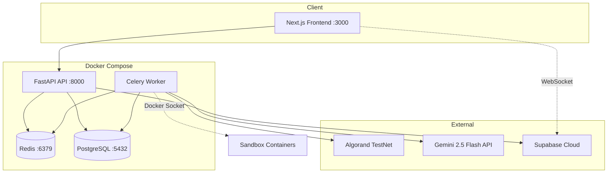

# VORTEX Protocol — Complete Project Description

## 1. One-Liner
**VORTEX** = Fault-tolerant, AI-verified bounty escrow on Algorand blockchain with 2-of-3 Oracle consensus.

---

## 2. Problem Statement

| Issue | Detail |
|---|---|
| **Subjective Disputes** | Centralized platforms (Upwork, Fiverr) use human boards → slow, biased |
| **High Fees** | Up to 20% platform commission |
| **No Code Verification** | Buyers "hope" the code works; no automated proof |
| **Payment Fraud** | Solvers "hope" they get paid; funds can be withheld |
| **AI/Plagiarism** | Hidden prompt injections, copy-paste spaghetti code |

---

## 3. VORTEX Solution (High Level)

Replace subjective human judgement with **Code-is-Law Enforcement**:

1. **Buyer** posts bounty → funds locked in Algorand smart contract escrow
2. **Solver** submits work → runs through 4-layer AI verification pipeline
3. **Oracle Network** (2-of-3 consensus) → releases or refunds funds on-chain
4. **Mastery NFT** minted as permanent proof of achievement

> Key differentiator: **Deterministic, trustless settlement** — no human arbitration needed for standard cases.

---

## 4. System Architecture Overview

---

## 5. The 4-Layer AI Verification Pipeline

This is the **core innovation**. When a solver submits work, it passes through:

### Layer 1: Static Analysis (Code Only)
- **What**: AST (Abstract Syntax Tree) parsing of submitted Python code
- **Checks for**: `eval()`, `exec()`, `subprocess`, `os.system`, `socket`, `pickle`, `__import__`
- **Result**: PASS/FAIL — blocks dangerous code before execution
- **File**: `backend/security.py` → `static_analysis()`

### Layer 2: Docker Sandbox Execution (Code Only)
- **What**: Runs submitted code against buyer-defined pytest tests in isolated Docker container
- **Security hardening**:
  - `network_disabled` — no internet access
  - `mem_limit: 128MB` — prevents OOM
  - `pids_limit: 50` — prevents fork bombs
  - `read_only` filesystem
  - `user: nobody` — drops root
  - `cap_drop: ALL` — removes all Linux capabilities
  - `no-new-privileges` — prevents escalation
  - `cpu_quota: 50%` — prevents host starvation
  - `45s hard timeout`
- **Image**: Pre-built `vortex-sandbox:latest` (python:3.9-alpine + pytest)
- **File**: `backend/sandbox.py` → `run_in_sandbox()`

### Layer 3: AI Jury Engine (All Asset Types)
- **What**: Multi-agent AI deliberation using Google Gemini 2.5 Flash
- **For code**: Advisory audit — checks logic, quality, requirements compliance
- **For media/docs/apps**: Multimodal evaluation:
  - **Apps**: Headless Playwright takes live screenshots → fed to Gemini Vision
  - **Documents/PDFs**: Binary ingestion into Gemini
  - **Images**: Direct Vision evaluation against brand guidelines
- **Architecture**: Consolidated Supreme Arbiter prompt (Prosecutor + Defender + Judge in one call)
- **Output**: Verdict (pass/fail), Score (0-100), Feedback, Prosecutor/Defender notes
- **File**: `backend/security.py` → `multi_agent_consensus()`, `multimodal_eval()`, `advisory_audit()`

### Layer 4: Adversarial Firewall
- **What**: Pre-flight scan of all submissions for prompt injection / jailbreak attempts
- **Detects**: "Ignore previous instructions", role manipulation, hidden payloads
- **Runs before**: AI Jury evaluation
- **File**: `backend/security.py` → `_adversarial_firewall()`

### Pipeline Flow Diagram

---

## 6. Smart Contract (Algorand — Puya/algopy)

**File**: `contracts/escrow.py` — `VortexEscrow` (ARC4Contract)

### Global State
| Field | Type | Purpose |
|---|---|---|
| `buyer` | Account | Bounty creator wallet |
| `developer` | Account | Solver wallet |
| `oracle_1/2/3` | Account | 3 independent oracle nodes |
| `bounty_amount` | UInt64 | Locked ALGO (microAlgos) |
| `bounty_id` | String | Off-chain bounty reference |
| `is_frozen` | bool | Emergency freeze flag |
| `is_settled` | bool | Settlement complete flag |
| `votes_release` | UInt64 | Release vote count |
| `votes_refund` | UInt64 | Refund vote count |
| `oracle_X_voted` | bool | Per-oracle double-vote prevention |

### Contract Methods

| Method | Access | Consensus | Action |
|---|---|---|---|
| `create_bounty()` | Buyer | N/A | Initialize escrow, lock funds via group tx |
| `vote_release()` | Oracle only | **2-of-3** | Release funds to developer |
| `vote_refund()` | Oracle only | **2-of-3** | Refund funds to buyer |
| `trigger_freeze()` | Oracle only | **1-of-3** | Emergency freeze (asymmetric safety) |
| `get_state()` | Anyone | N/A | Read-only state query |

### Security Assertions
- Payment > 0 (no empty escrows)
- Buyer ≠ Developer (no self-dealing)
- All 3 oracles unique (no single-entity takeover)
- Double-vote prevention per oracle
- Cannot vote if frozen or settled

### Asymmetric Design Philosophy
- **Easy to freeze**: 1-of-3 (conservative safety)
- **Hard to release/refund**: 2-of-3 (prevents theft)

---

## 7. Oracle Consensus Engine

**File**: `backend/oracle.py`

### How It Works
1. Three independent oracle accounts loaded from Supabase Vault or `.env`
2. After AI pipeline passes, Oracle 1 votes `vote_release`
3. Oracle 2 votes `vote_release` → triggers contract execution (2-of-3 reached)
4. Contract inner transaction sends escrowed ALGO to developer
5. Same pattern for refunds (`vote_refund`)
6. Any single oracle can `trigger_freeze` for emergencies

### Demo Mode
When `VORTEX_DEMO_MODE=true` or `app_id == 1001`:
- Oracle consensus is **simulated** (no actual Algorand calls)
- Generates fake TX IDs like `DEMO-ORACLE-XXXX`
- Full pipeline still runs (Static → Sandbox → AI Jury)

---

## 8. Data Models & Entities

### Database Tables (SQLAlchemy ORM)

| Entity | Key Fields | Purpose |
|---|---|---|
| **User** | wallet_address, role (buyer/seller), reputation_score, total_earned, skills, bio | User profiles |
| **Bounty** | title, description, requirements, verification_criteria, asset_type, reward_algo, status, deadline, app_id, category, difficulty | Posted jobs |
| **Submission** | bounty_id, seller_wallet, artifact, status, static_passed, sandbox_passed, jury_passed, settlement_time, tx_id, nft_id | Solver submissions |
| **Transaction** | wallet_address, type, amount, status, tx_hash | On-chain ledger sync |
| **Dispute** | bounty_id, initiator_wallet, reason, status | Dispute records |
| **Review** | from_wallet, to_wallet, rating (1-5), comment | Peer reviews |

### Key Enums
- **BountyStatus**: active → pending → settled / disputed / frozen / expired
- **SubmissionStatus**: pending → passed / failed / frozen
- **AssetType**: code, media, document, contract, general
- **Difficulty**: easy, medium, hard
- **Category**: python, javascript, rust, ai_ml, design, marketing, video, etc.

---

## 9. User Flows

### Flow A: Buyer (Hiring)

### Flow B: Solver (Freelancer)

### Flow C: Arbiter (Governance)

---

## 10. Frontend Pages

| Page | Route | Purpose |
|---|---|---|
| **Landing** | `/` | Hero, category cards, wallet connect (Pera/Defly/Demo) |
| **Dashboard** | `/dashboard` | User overview, stats, recent activity |
| **Bounties List** | `/bounties` | Browse & filter active bounties |
| **Create Bounty** | `/bounties/create` | Multi-step bounty creation with AI scope evaluation |
| **Bounty Detail** | `/bounties/[id]` | View bounty, submit work, watch Verification Terminal |
| **Disputes** | `/disputes` | Active disputes & voting interface |
| **Governance** | `/governance` | DAO governance panel, arbiter dashboard |
| **Profiles** | `/profiles/[wallet]` | Sovereign developer profiles, skills, reviews, Mastery Audits |
| **Protocol** | `/protocol` | Protocol-wide analytics |
| **Transactions** | `/transactions` | On-chain transaction feed |
| **Admin** | `/admin` | Admin panel |

### Key Frontend Components
- **Verification Terminal**: Real-time pipeline visualization (WebSocket via Supabase)
- **LivePulse**: Global protocol activity feed (SSE)
- **DebugPanel**: Developer diagnostics

---

## 11. Backend API Routers

| Router | Prefix | Key Endpoints |
|---|---|---|
| **identity** | `/auth` | `/nonce`, `/verify` (wallet auth), `/profile` CRUD |
| **marketplace** | `/bounties` | CRUD bounties, `/submit` work, list submissions |
| **pipeline** | `/pipeline` | `/evaluate-scope`, `/refine`, `/generate-tests`, `/validate-tests` |
| **governance** | `/disputes` | Create disputes, cast votes, arbiter dashboard |
| **telemetry** | `/events` | SSE live events, protocol pulse |
| **comments** | `/comments` | Bounty discussion threads |
| **health** | `/health` | System status (Algorand, Docker, Oracle nodes) |

---

## 12. Tech Stack Summary

| Layer | Technology |
|---|---|
| **Blockchain** | Algorand (Puya/algopy ARC-4 smart contracts) |
| **Smart Contract** | App ID 1001, PyTEAL-style escrow |
| **Backend API** | Python 3.11+, FastAPI |
| **Task Queue** | Celery + Redis |
| **Database** | SQLite (dev) / PostgreSQL 15 (prod) via SQLAlchemy + Alembic |
| **AI Engine** | Google Gemini 2.5 Flash (multi-agent) |
| **Frontend** | Next.js 16, React 19, Turbopack, CSS Modules |
| **State Mgmt** | Zustand |
| **Realtime** | Supabase Realtime (WebSockets) + SSE |
| **Wallets** | Pera Wallet, Defly Wallet |
| **Sandbox** | Docker-in-Docker (python:3.9-alpine) |
| **Auth** | Algorand ARC-0014 wallet signatures + JWT |
| **Logging** | Structlog (JSON) |
| **Rate Limiting** | SlowAPI |
| **Error Tracking** | Sentry (opt-in) |
| **Containerization** | Docker Compose |

---

## 13. Deployment Architecture

---

## 14. Key Environment Variables

| Variable | Purpose |
|---|---|
| `GEMINI_API_KEY` | AI Jury engine |
| `ALGORAND_ALGOD_URL` | Blockchain node |
| `ORACLE_[1-3]_MNEMONIC` | Oracle wallet keys |
| `DATABASE_URL` | DB connection |
| `SUPABASE_URL` + `SUPABASE_SERVICE_ROLE_KEY` | Realtime + Vault |
| `SECRET_KEY` | JWT signing |
| `VORTEX_DEMO_MODE` | `true` = simulate on-chain ops |
| `APP_ID` | Smart contract app ID (default: 1001) |

---

## 15. NFT & Credential System

After successful settlement:
1. Solver's artifact uploaded to cloud storage (gets a Content ID/CID)
2. **Mastery NFT** (ASA) minted on Algorand:
   - `unit_name: VRTX-M`
   - `asset_name: VORTEX Mastery: {bounty_title}`
   - `url: ipfs://{CID}`
   - Total supply: 1 (true NFT)
3. NFT ID stored on submission record
4. Displayed on solver's Sovereign Profile as permanent proof

---

## 16. Suggested PPT Slide Structure

| Slide # | Title | Content |
|---|---|---|
| 1 | Title Slide | VORTEX Protocol — logo, tagline, team |
| 2 | The Problem | Trust gap in freelancing, fees, no verification |
| 3 | The Solution | One-sentence + high-level architecture diagram |
| 4 | How It Works | Buyer → Escrow → Solver → Pipeline → Settlement |
| 5 | 4-Layer Pipeline | Diagram from Section 5 |
| 6 | Layer Deep-Dive | Static → Sandbox → AI Jury → Firewall details |
| 7 | Smart Contract | Escrow design, 2-of-3 oracle, asymmetric freeze |
| 8 | Oracle Consensus | 3-node voting, release/refund/freeze |
| 9 | Multimodal AI | Code + Design + Docs + Apps → Gemini Vision |
| 10 | Tech Stack | Table from Section 12 |
| 11 | User Flows | Buyer / Solver / Arbiter diagrams |
| 12 | Frontend Demo | Screenshots of key pages |
| 13 | NFT Credentials | Mastery NFT system |
| 14 | Architecture | Deployment diagram from Section 13 |
| 15 | Why Algorand | Fast finality, low fees, ARC-4, ASA NFTs |
| 16 | Market Impact | Comparison vs Upwork/Fiverr |
| 17 | Future Roadmap | Multi-chain, reputation staking, marketplace |
